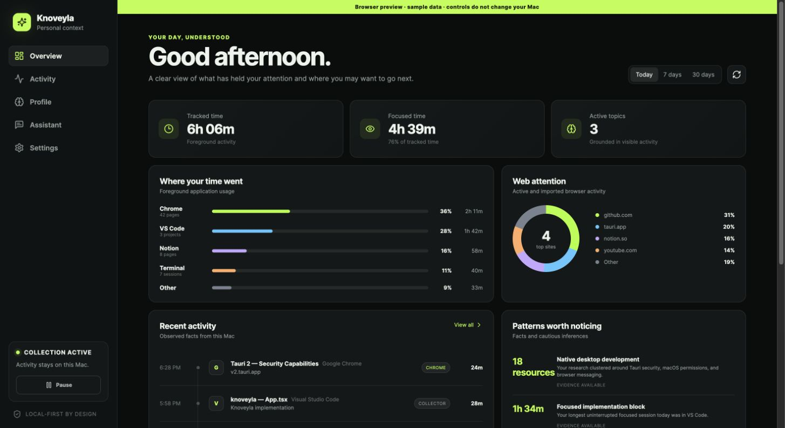

# Knoveyla

Knoveyla is a local-first personal context assistant for Apple Silicon Macs. The
technical alpha records foreground application activity and explicitly permitted
Chrome metadata, keeps detailed activity in a local SQLite database, and sends a
minimized digest or an active chat conversation directly to a user-selected AI
provider.

This repository implements the alpha described in
[`knoveyla_prd.md`](knoveyla_prd.md). It is not a production-ready release.

## Screenshot



## Alpha status

Implemented and usable from source:

- Tauri 2 desktop app with React, TypeScript, Rust, and SQLite
- macOS foreground app and active-window-title collection
- explicit Chrome-profile selection and up-to-90-day history bootstrap
- 30-day detailed-activity retention and post-bootstrap cleanup
- Chrome Manifest V3 companion extension with active-tab timing
- OpenAI and Anthropic BYOK credentials through macOS Keychain
- direct provider-backed profile refresh, recommendations, and chat
- dashboard, activity history, profile corrections, pause, and delete controls

Important alpha limitations:

- macOS 26 on Apple Silicon is the tested target. Safari, Firefox, Intel Macs,
  Windows, and Linux are not implemented release targets.
- Accessibility permission is required for window titles.
- Source builds still require loading the extension unpacked; Settings can
  register its Native Messaging host after the helper is built.
- Desktop collection state is synchronized to the extension; exclusion lists
  remain source-specific.
- Launch at login is user-controlled in Settings.
- The behavioral-guidance preference suppresses behavioral recommendations.
- Basic time/page activity insights are implemented, but topic/content
  categorization and some PRD control surfaces remain incomplete. Browser
  preview mode uses sample data.

See [Alpha setup](docs/alpha-setup.md) for the complete setup and limitation
notes.

## Install the app

Requirements:

- Apple Silicon Mac running macOS 26
- Git
- Xcode Command Line Tools
- Node.js 20.19+ or 22.12+ and npm
- current stable Rust toolchain
- Google Chrome 120+ for the companion extension

### 1. Download the source

Clone this repository and enter its directory:

```sh
git clone https://github.com/Marstronix218/knoveyla.git
cd knoveyla
```

If you already downloaded the repository as a ZIP, extract it, open Terminal,
type `cd ` with a trailing space, drag the extracted `knoveyla` folder into the
Terminal window, and press Return.

### 2. Install dependencies

From the `knoveyla` repository root:

```sh
npm install
```

This installs the desktop and Chrome-extension npm workspaces. Rust downloads
and compiles the native dependencies the first time the desktop app is started
or built.

### 3. Choose how to run Knoveyla

For the quickest source-development launch:

```sh
npm run dev:desktop
```

This starts the Vite frontend inside the native Tauri application. Keep the
terminal open while using Knoveyla; stopping the process also stops activity
collection and the local Chrome bridge.

To create an installable macOS application instead:

```sh
npm run build:desktop
open apps/desktop/src-tauri/target/release/bundle/macos
```

When Finder opens, drag **Knoveyla.app** into **Applications**, then launch it
from that folder. This technical-alpha bundle is unsigned and not notarized. If
macOS blocks the first launch, Control-click **Knoveyla.app**, choose **Open**,
and confirm that you want to open it.

Running `npm run dev` starts only the browser preview. It uses mock data and
cannot collect activity, access Keychain, or call native commands, so it is not
a substitute for the native app.

## First-time setup

Knoveyla opens a four-step setup wizard on its first native launch:

1. **Welcome:** review what Knoveyla collects and how the data is handled.
2. **Permissions:** choose **Open macOS permission prompt** if you want active
   window titles. In **System Settings → Privacy & Security → Accessibility**,
   enable the running Knoveyla development process. App-duration tracking still
   works without this permission, but window-title context is unavailable. If
   the permission does not take effect immediately, restart the app.
3. **Browser profiles:** select at least one detected Chrome profile. Knoveyla
   temporarily imports up to 90 days of history to build the initial profile;
   history older than 30 days is removed after that profile succeeds.
4. **AI provider:** select OpenAI or Anthropic, paste an API key, and choose
   **Build my first profile**. The key is stored in macOS Keychain. Building the
   initial profile requires a working key and an internet connection to the
   selected provider.

When setup finishes, confirm that the sidebar says **Collection active**. Use
**Resume** if collection is paused.

For later source-development sessions, the native provider client can override
the Keychain credential with `OPENAI_API_KEY` or `ANTHROPIC_API_KEY` from its
environment:

```sh
OPENAI_API_KEY="your-key" npm run dev:desktop
```

The first-run wizard still requires entering a key to configure the selected
provider. Knoveyla does not load `.env` files automatically.

## Connect the Chrome companion

The initial history import works without the extension. Install the companion
when you also want accurate active-tab timing as you browse.

1. Build the extension from the repository root:

   ```sh
   npm run build --workspace @knoveyla/chrome-extension
   ```

2. Build the Native Messaging helper used by the development app:

   ```sh
   cargo build \
     --manifest-path apps/desktop/src-tauri/Cargo.toml \
     --bin knoveyla-native-host
   ```

3. Open `chrome://extensions`, enable **Developer mode**, choose **Load
   unpacked**, and select `apps/extension/dist`.
4. Copy the 32-character ID from the Knoveyla extension card.
5. In the desktop app, open **Settings → Chrome companion pairing**, paste the
   extension ID, and choose **Register native host**.
6. Restart Chrome so it sees the Native Messaging registration.
7. Return to desktop **Settings** and copy both the masked **Pairing token** and
   the ID shown under the approved entry in **Browser profiles**.
8. Open the extension's **Details → Extension options** page. Keep
   **Native Messaging (recommended)** selected, paste the pairing token and
   approved Chrome profile ID, then choose **Save and verify**.
9. Open the extension popup. A successful setup shows **Collection is on** and
   a connected local-app status.

Repeat the load and pairing steps for each Chrome profile you want to approve.
You do not need to register the Native Messaging host again when Chrome shows
the same extension ID. If Chrome assigns a new ID after the extension is
reloaded or reinstalled, register the new ID again; the alpha host manifest
authorizes one extension ID at a time. See
[Chrome extension setup](docs/alpha-setup.md#chrome-extension-setup) for manual
Native Messaging registration and the development-only local HTTP fallback.

## Use Knoveyla

### Control collection

The card at the bottom of the sidebar always shows the current desktop
collection state. Choose **Pause** to stop storing new activity or **Resume** to
start again. The **Collection active** toggle in Settings controls the same
state. The Chrome companion observes a desktop pause on its next status check;
after resuming in the desktop app, also check the extension popup and resume it
there if it remains paused.

The extension popup shows its connection, collection state, and the page
currently being timed. Its **Pause collection** button is useful when you want
to stop browser collection directly.

### Review the Overview

Open **Overview** to see tracked and focused time, application usage, web
attention, recent activity, inferred patterns, and recommendations. Use
**Today**, **7 days**, or **30 days** to change the reporting period.

Choose the refresh icon beside the date range to rebuild the profile and
recommendations from current local data. Expand **Why am I seeing this?** on a
recommendation to inspect its evidence. Use the close button to dismiss a
recommendation, or **Not useful** to dismiss it while recording that feedback.

### Inspect the Activity timeline

Open **Activity** to inspect individual records. Each row shows the time, page
or window title, application, source, and duration. The source labels distinguish
desktop collection (`collector`), imported Chrome history (`history`), and live
extension activity (`chrome`).

Change the date range or use **Filter apps, pages, or topics** to narrow the
timeline. Detailed activity is retained locally for 30 days.

### Correct the Profile

Open **Profile** to review Knoveyla's current understanding:

- **inferred** items were generated from activity and can be hidden with the
  close button;
- **observed** items come directly from recorded activity; and
- **user** items are authoritative corrections that override inference.

Choose **Add correction** to save something Knoveyla should treat as true.
User corrections can later be edited or removed. Use **Edit summary** to replace
the generated profile summary with your own text, or **Clear** to remove the
saved summary.

### Use the Assistant

Open **Assistant**, enter a question, and choose **Send**. Knoveyla sends the
active conversation and relevant profile context directly to your configured
provider; raw activity records are not attached. Chat history is not persisted
and starts over when you leave the Assistant page or reload the app.

### Configure Settings

Use **Settings** to:

- switch between OpenAI and Anthropic, save or remove the selected provider's
  Keychain credential, and run **Test connection**;
- enable or disable collection, behavioral break/focus guidance, and launch at
  login;
- inspect Accessibility and Chrome connection diagnostics and the local
  database path;
- approve or remove Chrome profiles;
- register the Chrome Native Messaging host; and
- manage exclusions and deletion.

## Privacy controls and deletion

Under **Settings → Exclusions**, enter comma-separated application names and
domains, then choose **Save exclusions**. Matching desktop activity is dropped
locally before it can affect the profile. Add browser domains separately in the
extension settings, one domain per line; a rule such as `example.com` also
excludes its subdomains.

To reset Knoveyla, use **Settings → Delete Knoveyla data → Delete everything**.
This permanently removes app-owned activity, profiles, corrections,
recommendations, settings, provider credentials, and the Native Messaging
manifest, then rotates the pairing token. It does not remove the unpacked Chrome
extension or clear the extension's local settings; remove the extension from
`chrome://extensions` to clear those.

## Troubleshooting

- **The browser preview contains sample data:** launch with
  `npm run dev:desktop`; `npm run dev` is a frontend-only preview.
- **Window titles are missing:** grant Accessibility access in macOS System
  Settings, then restart the Tauri app.
- **No Chrome profiles appear:** install and open Chrome at least once, make
  sure the desired profile exists locally, and relaunch Knoveyla.
- **The extension is disconnected:** keep the desktop app running, confirm the
  pairing token and approved profile ID, re-register the current 32-character
  extension ID, restart Chrome, and choose **Test connection** in extension
  settings.
- **Provider actions fail:** open **Settings → AI provider**, confirm the
  selected provider has the correct key, and choose **Test connection**.
- **No new activity appears:** confirm the sidebar and extension both show
  collection on, then check the desktop and extension exclusion lists.

## Verification

```sh
npm run typecheck
npm test
npm run build
npm run check:rust
npm run test:rust
npm run build:desktop
```

The Chrome extension build is written to `apps/extension/dist`. Load that
directory as an unpacked extension only after following
[Chrome extension setup](docs/alpha-setup.md#chrome-extension-setup).
The desktop bundle is written to
`apps/desktop/src-tauri/target/release/bundle/macos/Knoveyla.app`. It is an
unsigned technical-alpha build; code signing and notarization are not included.

## Documentation

- [Alpha setup](docs/alpha-setup.md)
- [Architecture](docs/architecture.md)
- [Privacy model](docs/privacy-model.md)
- [Threat model](docs/threat-model.md)
- [Testing](docs/testing.md)
- [Product requirements](knoveyla_prd.md)

## License

This repository is currently `UNLICENSED`.
