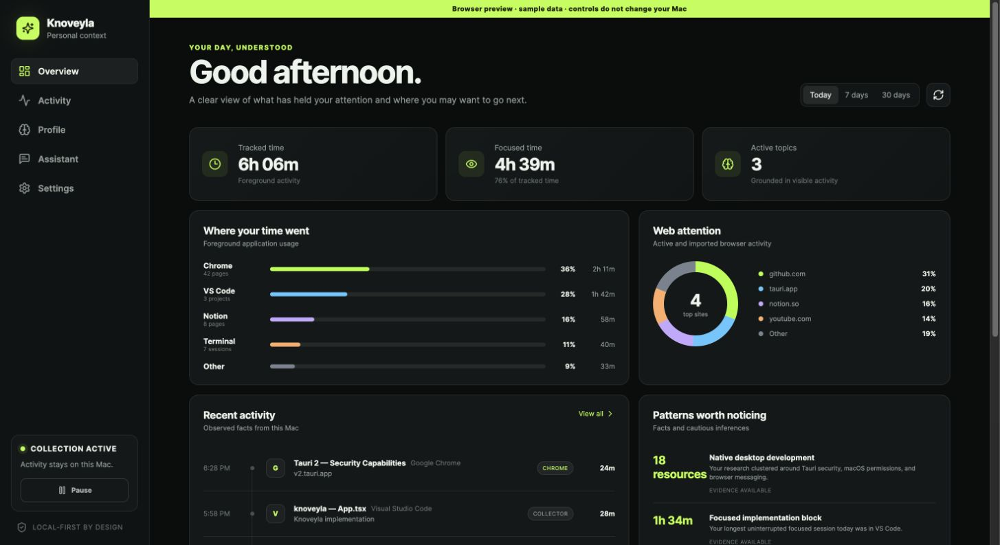

# Knov

Knov is a local-first personal context assistant for Apple Silicon Macs. The
technical alpha records foreground application activity, explicitly permitted
Chrome metadata, and metadata-only editor changes. It keeps detailed activity in
a local SQLite database and sends only a minimized digest or token-budgeted chat
context directly to a user-selected AI provider.

This repository implements the alpha described in
[`knov_prd.md`](knov_prd.md). It is not a production-ready release.

## Screenshot



## Alpha status

Implemented and usable from source:

- Tauri 2 desktop app with React, TypeScript, Rust, and SQLite
- macOS foreground app and active-window-title collection
- explicit Chrome-profile selection and up-to-90-day history bootstrap
- 30-day detailed-activity retention and post-bootstrap cleanup
- optional experimental Chrome Manifest V3 companion extension with active-tab timing
- metadata-only Local History and recent Git-path signals from supported editors
- semantic work threads across app, browser, document, and editor evidence
- saved adaptive workflow interviews and editable, evidence-backed workflow
  documents with a local revisioned knowledge graph
- privacy-safe link-only resource previews and one-click thread resumption
- deterministic, sanitized context packing with local context-economics metrics
- OpenAI, Anthropic, and Amazon Bedrock BYOK credentials through macOS Keychain
- direct provider-backed profile refresh, recommendations, and chat
- opt-in Prediction Experiment with local history retrieval, a deterministic
  baseline, a workflow-based next-step source, provider candidates, local
  outcome evaluation, and confidence calibration
- local work agent: workflow discovery, automation-opportunity scoring,
  inferred goals, editable Skills, permissioned and verified actions (open a
  page or app, write a local draft, run allow-listed tests in an approved
  folder), an action journal with undo, a kill switch, and permission
  suggestions earned from repeated approval
- dashboard, activity history, profile corrections, pause, and delete controls
- command menu (⌘K) and page shortcuts (⌘1–⌘9)

Important alpha limitations:

- macOS 26 on Apple Silicon is the tested target. Safari, Firefox, Intel Macs,
  Windows, and Linux are not implemented release targets.
- Accessibility permission is required for window titles.
- The optional companion is a post-MVP experiment and must be loaded unpacked;
  its Native Messaging host is registered manually for compatibility testing.
- Desktop collection state is synchronized to the extension; exclusion lists
  remain source-specific.
- Launch at login is user-controlled in Settings.
- The behavioral-guidance preference suppresses behavioral recommendations.
- Basic time/page activity insights are implemented, but topic/content
  categorization and some PRD control surfaces remain incomplete. Browser
  preview mode uses sample data.

See [Alpha setup](docs/alpha-setup.md) for the complete setup and limitation
notes.

## Install the app

Requirements:

- Apple Silicon Mac running macOS 26
- Git
- Xcode Command Line Tools
- Node.js 20.19+ or 22.12+ and npm
- current stable Rust toolchain
- Google Chrome (required for selected-profile history import; Chrome 120+ for
  the optional companion extension)

### 1. Download the source

Clone this repository and enter its directory:

```sh
git clone https://github.com/Marstronix218/knov.git
cd knov
```

If you already downloaded the repository as a ZIP, extract it, open Terminal,
type `cd ` with a trailing space, drag the extracted `knov` folder into the
Terminal window, and press Return.

### 2. Install dependencies

From the `knov` repository root:

```sh
npm install
```

This installs the desktop and Chrome-extension npm workspaces. Rust downloads
and compiles the native dependencies the first time the desktop app is started
or built.

### 3. Choose how to run Knov

For the quickest source-development launch:

```sh
npm run dev:desktop
```

This starts the Vite frontend inside the native Tauri application. Keep the
terminal open while using Knov; stopping the process also stops activity
collection and the local Chrome bridge.

If Tauri reports that `cargo metadata` failed with `No such file or directory`,
Rust's tools are not available in the current shell. Restart Terminal or reload
the environment installed by `rustup`, confirm Cargo is available, and retry:

```sh
source "$HOME/.cargo/env"
cargo --version
npm run dev:desktop
```

If this recurs in zsh, add `. "$HOME/.cargo/env"` to `~/.zprofile`.

To create an installable macOS application instead:

```sh
npm run build:desktop
open apps/desktop/src-tauri/target/release/bundle/macos
```

When Finder opens, drag **Knov.app** into **Applications**, then launch it
from that folder. This technical-alpha bundle is unsigned and not notarized. If
macOS blocks the first launch, Control-click **Knov.app**, choose **Open**,
and confirm that you want to open it.

Running `npm run dev` starts only the browser preview. It uses mock data and
cannot collect activity, access Keychain, or call native commands, so it is not
a substitute for the native app.

## First-time setup

Knov opens a four-step setup wizard on its first native launch:

1. **Welcome:** review what Knov collects and how the data is handled.
2. **Permissions:** choose **Open macOS permission prompt** if you want active
   window titles. In **System Settings → Privacy & Security → Accessibility**,
   enable the running Knov development process. App-duration tracking still
   works without this permission, but window-title context is unavailable. If
   the permission does not take effect immediately, restart the app.
3. **Browser profiles:** select at least one detected Chrome profile. Knov
   temporarily imports up to 90 days of history to build the initial profile;
   history older than 30 days is removed after that profile succeeds.
4. **AI provider:** select OpenAI, Anthropic, or Amazon Bedrock, paste an API key, and choose
   **Build my first profile**. The key is stored in macOS Keychain. Building the
   initial profile requires a working key and an internet connection to the
   selected provider. Choose **Skip AI for now** to start with local features
   only: Knov imports the last 30 days of selected history, and threads,
   workflows, and the work agent work immediately. Add a key later in
   **Settings** and refresh from **Now** to build a profile.

When setup finishes, confirm that the sidebar says **Collection active**. Use
**Resume** if collection is paused.

For later source-development sessions, the native provider client can override
the Keychain credential with `OPENAI_API_KEY`, `ANTHROPIC_API_KEY`, or
`AWS_BEDROCK_API_KEY` from its environment:

```sh
OPENAI_API_KEY="your-key" npm run dev:desktop
```

The first-run wizard still requires entering a key to configure the selected
provider. Knov does not load `.env` files automatically.

## Optional: connect the experimental Chrome companion

The MVP does not require the extension: onboarding, history bootstrap, and
foreground app/window collection work through the desktop app alone. Install
the implemented companion only when developing or evaluating the post-MVP
active-tab timing enhancement.

1. Build the extension from the repository root:

   ```sh
   npm run build --workspace @knov/chrome-extension
   ```

2. Build the Native Messaging helper used by the development app:

   ```sh
   cargo build \
     --manifest-path apps/desktop/src-tauri/Cargo.toml \
     --bin knov-native-host
   ```

3. Open `chrome://extensions`, enable **Developer mode**, choose **Load
   unpacked**, and select `apps/extension/dist`.
4. Copy the 32-character ID from the Knov extension card.
5. Follow the manual Native Messaging registration in
   [Alpha setup](docs/alpha-setup.md#3-register-the-helper-with-chrome).
6. Start the compatibility build with `npm run dev:with-extension`, then restart
   Chrome so it sees the Native Messaging registration.
7. Copy the pairing token as described in Alpha setup and the approved profile
   ID shown under desktop **Settings → Browser profiles**.
8. Open the extension's **Details → Extension options** page. Keep
   **Native Messaging (recommended)** selected, paste the pairing token and
   approved Chrome profile ID, then choose **Save and verify**.
9. Open the extension popup. A successful setup shows **Collection is on** and
   a connected local-app status.

Repeat the load and pairing steps for each Chrome profile you want to approve.
You do not need to register the Native Messaging host again when Chrome shows
the same extension ID. If Chrome assigns a new ID after the extension is
reloaded or reinstalled, register the new ID again; the alpha host manifest
authorizes one extension ID at a time. See
[Chrome extension setup](docs/alpha-setup.md#optional-chrome-extension-setup) for manual
Native Messaging registration and the development-only local HTTP fallback.

## Use Knov

### Control collection

The card at the bottom of the sidebar always shows the current desktop
collection state. Choose **Pause** to stop storing new activity or **Resume** to
start again. The **Collection active** toggle in Settings controls the same
state. The Chrome companion observes a desktop pause on its next status check;
after resuming in the desktop app, also check the extension popup and resume it
there if it remains paused.

The extension popup shows its connection, collection state, and the page
currently being timed. Its **Pause collection** button is useful when you want
to stop browser collection directly.

### Resume work from Now

Open **Now** to see the work thread Knov believes you are most likely to
continue, the local evidence behind it, and a suggested next move. Choose
**Resume thread** to reopen its latest available web resource, **Ask with
context** to start a provider-backed conversation with an inspectable context
packet, or **Copy brief** to use that context elsewhere. Knov sanitizes and
packs the selected evidence under a token budget; full URLs, local absolute
paths, credential-like fields, and unrelated raw activity are not attached.

Choose another active thread to change the focal context. Open **Attention
details** when you want supporting app, web, timeline, and pattern analytics.
Use **Today**, **7 days**, or **30 days** to change the reporting period, and
the refresh icon to rebuild the profile and recommendations.

### Act on what's ready

When the work agent has something for you, **Now** shows a **Ready for you**
panel above the resume card. It holds at most a few items:

- your **current goal**, inferred from threads that recur across days, with
  **Why?** evidence and **Confirm goal** / **Not a goal**;
- runs **waiting for your decision**, and recent background runs that finished
  or need a look;
- the **next step of a workflow** you are part-way through, with **Stage next
  steps** when it has a skill;
- a **permission suggestion** once you have approved the same action in the
  same place five times without declining or undoing it.

Choose **Review** to see exactly what Knov plans to do, why, which permission
applies, and its risk class. Untick anything you do not want, optionally allow
an action automatically for that skill or workspace from now on, and choose
**Approve and run**. Results show verification checks, local command output,
**Open draft**, and **Undo** where possible.

### Teach Knov your workflows

Open **Workflows** to review repeated work Knov found locally: the same three
or more steps in order, at least three times on two or more days. Each card
shows the steps, how often and when they happen, how often you finish once
you start, recent occurrences (apps, sites, and page paths only), and an
opportunity score with its breakdown.

- **Yes, this is a workflow** or **Not a workflow** records your review.
- **Confirm and create skill** turns it into a **Skill**: Knov opens the pages
  and apps the workflow uses, can save a resume brief to its Drafts folder, and
  can run your tests if you approve the project folder. Searches, sensitive
  sites, and editing stay with you.
- In **Skills**, choose **Run now**, or **Edit** to rename, toggle steps, pick
  a check for terminal steps, choose whether to stop or continue when a step
  needs attention, and set a trigger: only when you run it, when you start the
  workflow, or on a schedule.
- **Rescan** re-mines the last 30 days immediately; Knov otherwise rescans at
  most every 30 minutes when there is new activity.

### Interview and correct a workflow

Open **Workflow Discovery** (⌘8) and describe a task or select an existing work
thread. Starting saves the interview locally. With a provider key configured in
Settings, answer a question to reconstruct the process and receive a focused
follow-up. You can skip, pause, resume a saved session, or finish locally even
without a provider key. Answers and bounded interview context go directly to
your selected provider only when you answer or skip.

Choose **Review & edit workflow** to correct the business goal, trigger, actors,
ordered steps, decisions, resources, exceptions, and outcomes. Confirmation is
an explicit checkbox; saving a draft does not confirm it. Open **Knowledge**
(⌘9) to inspect your interview workflows, interactive step diagrams, graph
relationships, evidence, and previous revisions. **Delete** in an interview
removes its transcript, workflow, and graph history after confirmation.

This extends the existing activity-based workflow experience.
See [Workflow intelligence](docs/workflow-discovery.md) for its
implementation scope, privacy boundaries, and remaining milestones. Interview
confirmation does not authorize an agent action. Gmail and Slack connectors and
interview-to-Skill generation are not implemented in this slice.

### Control what the agent may do

Open **Agent** (Delegated work):

- **Work** lists runs waiting for you and the full history. Opening a run shows
  what Knov believed at the time, each action's permission, verification, and
  output, and **Undo** for drafts you have not edited.
- **Permissions** holds the hourly budget for automatic actions, permission
  suggestions, active permissions with **Revoke**, a form to allow, always ask,
  or never allow an action everywhere, for one skill, or for one workspace
  (optionally for 7 or 30 days), the approved project folders for checks, and
  the risk table that explains the defaults.
- **Insights** lists goals to confirm, rename, complete, or dismiss, outcome
  metrics such as completion, verification, approval, and undo rates, and the
  preferences Knov has learned from your decisions.

**Pause agent** (also in the sidebar, Settings, and the command menu) is the
kill switch: nothing runs while it is paused, including actions already
approved. It is separate from collection. Knov never sends messages, deletes
data, pays, or changes repositories, and background runs never open windows or
apps on their own. See [Autonomous Work Agent](docs/autonomous-agent.md).

### Move quickly

Press **⌘K** for the command menu to jump to any page, ask with context,
pause or resume collection or the agent, or rescan workflows. **⌘1**–**⌘9**
switch pages directly.

### Try the Prediction Experiment

The Prediction Experiment is off by default. Enable it in **Settings** to let
Knov estimate likely next work intents, actions, and resources from recent
activity, semantic threads, and similar local history. Knov records a
deterministic baseline, a workflow-based next step when you are part-way
through a known workflow, and, when a provider key is configured, up to three
provider candidates so their outcomes can be compared. Each prediction also
records your inferred goal at the time. The provider receives only minimized, sanitized context; the
prediction records, observed outcomes, match scores, and optional feedback stay
in local SQLite.

Predictions above the current confidence threshold can appear under **Likely
next** on Now. Lower-confidence candidates remain available to the local
evaluation path without being shown. **Resume predicted work** uses Knov's
existing safe thread/resource resumption. It does not edit files, run commands,
send messages, submit forms, or otherwise execute work autonomously.

See [Prediction Engine](docs/prediction-engine.md) for the architecture,
triggering, local schema, evaluator, and privacy boundaries.

### Review Threads

Open **Threads** to inspect the provisional work streams Knov reconstructs from
activity. Selecting a thread shows its summary, suggested next move, and exact
available evidence. Repeated subjects can join one thread across searches,
videos, sites, documents, and supported editor metadata. Thread groupings are
inferences rather than confirmed user intent.

### Inspect the Activity timeline

Open **Activity** to inspect individual records. Each row shows the time, page
or window title, application, source, and duration. The source labels distinguish
desktop collection (`collector`), imported Chrome history (`history`), and live
extension activity (`chrome`), and metadata-only editor changes (`editor`).

Change the date range or use **Filter apps, pages, or topics** to narrow the
timeline. Detailed activity is retained locally for 30 days.

### Correct Memory

Open **Memory** to review Knov's current understanding:

- **inferred** items were generated from activity and can be hidden with the
  close button;
- **observed** items come directly from recorded activity; and
- **user** items are authoritative corrections that override inference.

Choose **Add correction** to save something Knov should treat as true.
User corrections can later be edited or removed. Use **Edit summary** to replace
the generated profile summary with your own text, or **Clear** to remove the
saved summary.

### Ask with context

Choose **Ask with context** from Now to review the candidate context, enter a
question, and choose **Send**. Knov retrieves relevant profile facts locally,
adds query-specific activity aggregates, and deterministically packs sanitized
selected-thread evidence under the configured token budget. The assistant shows
the sent context, the larger local comparison baseline, token savings, provider
usage, and locally stored run metrics. Chat history is not persisted.

### Configure Settings

Use **Settings** to:

- switch between OpenAI, Anthropic, and Amazon Bedrock, save or remove the selected provider's
  Keychain credential, and run **Test connection**;
- enable or disable collection, behavioral break/focus guidance, and launch at
  login;
- enable or disable the Prediction Experiment and inspect its local history,
  evaluation metrics, and confidence calibration;
- pause or resume agent execution (the kill switch) and jump to agent
  permissions and history;
- inspect Accessibility and Chrome connection diagnostics and the local
  database path;
- approve or remove Chrome profiles;
- register the Chrome Native Messaging host; and
- manage exclusions and deletion.

## Privacy controls and deletion

Under **Settings → Exclusions**, enter comma-separated application names and
domains, then choose **Save exclusions**. Matching desktop activity is dropped
locally before it can affect the profile. Add browser domains separately in the
extension settings, one domain per line; a rule such as `example.com` also
excludes its subdomains.

To reset Knov, use **Settings → Delete Knov data → Delete everything**.
This permanently removes app-owned activity, profiles, corrections,
recommendations, predictions, prediction feedback and evaluations, learned
workflows, discovery interviews and their workflow/graph revisions, skills,
agent runs and the action journal, permissions, approved
workspaces, goal reviews, state snapshots, agent drafts, settings, provider
credentials, and the Native Messaging manifest, then rotates the pairing
token. It does not remove the unpacked Chrome extension or clear the
extension's local settings; remove the extension from `chrome://extensions` to
clear those.

## Troubleshooting

- **The browser preview contains sample data:** launch with
  `npm run dev:desktop`; `npm run dev` is a frontend-only preview.
- **Window titles are missing:** grant Accessibility access in macOS System
  Settings, then restart the Tauri app.
- **No Chrome profiles appear:** install and open Chrome at least once, make
  sure the desired profile exists locally, and relaunch Knov.
- **The extension is disconnected:** keep the desktop app running, confirm the
  pairing token and approved profile ID, re-register the current 32-character
  extension ID, restart Chrome, and choose **Test connection** in extension
  settings.
- **Provider actions fail:** open **Settings → AI provider**, confirm the
  selected provider has the correct key, and choose **Test connection**.
- **No new activity appears:** confirm the sidebar and extension both show
  collection on, then check the desktop and extension exclusion lists.
- **No workflows appear:** workflows need the same three or more steps in order
  at least three times on two or more days. Keep collection on and choose
  **Rescan** later.
- **A check cannot start:** Knov looks for `cargo`, `npm`, and similar tools
  in your `PATH`, `/opt/homebrew/bin`, `/usr/local/bin`, `~/.cargo/bin`, and
  `~/.local/bin`. Version managers that only modify an interactive shell (for
  example nvm) may not be visible to the app.
- **Nothing runs:** check that the agent is not paused in the sidebar.

## Verification

```sh
npm run typecheck --workspace @knov/desktop
npm test --workspace @knov/desktop
npm run build --workspace @knov/desktop
npm run check:rust
npm run test:rust
npm run build:desktop
```

These are the baseline desktop MVP checks. The optional extension compatibility
lane is documented in [Testing](docs/testing.md#optional-extension-compatibility-lane).
Its build is written to `apps/extension/dist`; load that directory unpacked only
after following [Chrome extension setup](docs/alpha-setup.md#optional-chrome-extension-setup).
The desktop bundle is written to
`apps/desktop/src-tauri/target/release/bundle/macos/Knov.app`. It is an
unsigned technical-alpha build; code signing and notarization are not included.

## Documentation

- [Alpha setup](docs/alpha-setup.md)
- [Architecture](docs/architecture.md)
- [Privacy model](docs/privacy-model.md)
- [Prediction Engine](docs/prediction-engine.md)
- [Autonomous Work Agent](docs/autonomous-agent.md)
- [Workflow intelligence](docs/workflow-discovery.md)
- [Threat model](docs/threat-model.md)
- [Testing](docs/testing.md)
- [Product requirements](knov_prd.md)

## License

This repository is currently `UNLICENSED`.
