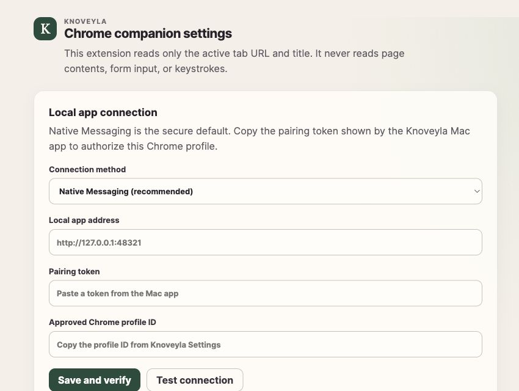

# Knov Chrome Companion

Manifest V3 extension for accurate active-tab timing. It observes only Chrome's
tab metadata APIs and sends URL, title, focus timestamps, and duration to the
paired Knov app on the same computer.

## Screenshot



## Prerequisites

The companion is useful only with the native Knov desktop app running on the
same Mac. Complete desktop onboarding first, approve the Chrome profile you want
to pair, and leave the app open while configuring the extension. If you have not
downloaded and installed Knov yet, follow
[Install the app](../../README.md#install-the-app) first.

## Build, load, and pair

If you installed Knov from a bundle but do not have the repository locally,
download it before building the unpacked extension:

```sh
git clone https://github.com/Marstronix218/knov.git
cd knov
```

From the `knov` repository root:

```sh
npm install
npm run build --workspace @knov/chrome-extension
```

When using `npm run dev:desktop`, build the Native Messaging helper as well:

```sh
cargo build \
  --manifest-path apps/desktop/src-tauri/Cargo.toml \
  --bin knov-native-host
```

Then:

1. Open `chrome://extensions`.
2. Enable **Developer mode**, choose **Load unpacked**, and select
   `apps/extension/dist`.
3. Copy the 32-character ID shown on the Knov extension card.
4. In the desktop app, open **Settings → Chrome companion pairing**, paste the
   extension ID, and choose **Register native host**.
5. Restart Chrome.
6. In desktop **Settings**, copy the **Pairing token** and the ID shown under
   the approved entry in **Browser profiles**.
7. Open the extension's **Details → Extension options** page. Select **Native
   Messaging (recommended)**, paste the token into **Pairing token**, paste the
   desktop profile ID into **Approved Chrome profile ID**, and choose **Save and
   verify**.
8. Confirm the result says **Connected. Settings saved.**

The desktop app must remain running for connection tests and live event
delivery. Repeat the load and pairing steps inside each Chrome profile you want
Knov to observe; registration can be reused when Chrome shows the same
extension ID. The alpha Native Messaging manifest authorizes one extension ID
at a time, so registering a different ID replaces the previous allowed origin.
Do not share the pairing token in screenshots, logs, issues, or source control.

## Use the extension

Select the Knov toolbar icon to open the popup. It shows:

- whether collection is on or paused;
- whether the desktop app is connected;
- the title and domain of the page currently being timed; and
- how many completed events are waiting for delivery.

Choose **Pause collection** before browsing something you do not want recorded,
then **Resume collection** when you are ready. Collection also stops when Chrome
loses focus, the active page changes to an excluded or unsupported URL, or the
desktop app pauses collection.

Choose **Settings** in the popup to reopen extension options. Under **Excluded
websites**, enter one domain per line and choose **Save and verify**. A rule such
as `example.com` also excludes its subdomains. When the active page begins
matching a saved exclusion, timing stops immediately and the event is not
queued. Desktop exclusions and extension exclusions are configured separately.

## Confirm it is working

1. Keep the desktop app running with collection active.
2. Open a normal HTTP or HTTPS page in Chrome and keep Chrome focused.
3. Open the extension popup and confirm it shows **Collection is on**, a
   connected status, and the current page.
4. Switch tabs or applications to complete the timed event.
5. In the desktop app, open **Activity** and look for a row whose source is
   `chrome`.

Incognito pages are not collected. Chrome internal pages, extension pages,
invalid URLs, and non-HTTP(S) URLs are also ignored.

## Troubleshooting

- **Native host not found or disconnected:** rebuild the native helper if
  necessary, register the current extension ID again in desktop Settings, and
  restart Chrome.
- **Authentication or pairing error:** copy the current desktop pairing token
  again and verify that the approved Chrome profile ID matches the profile in
  which the extension is loaded.
- **Connected but no page is shown:** focus a normal HTTP(S) tab, confirm
  collection is on in both apps, and check the extension exclusion list.
- **The extension ID changed:** re-register the new 32-character ID in the
  desktop app. Chrome may assign a different ID when an unpacked extension is
  installed again.
- **The desktop app is unavailable:** live timing cannot be delivered, but
  Knov can still use imported Chrome history after the desktop app starts.

For manual host registration and the local HTTP development fallback, see
[Chrome extension setup](../../docs/alpha-setup.md#chrome-extension-setup).

## Native Messaging contract

Production communication uses Chrome Native Messaging host
`com.knov.companion`. Its host manifest must list the unpacked extension's
origin under `allowed_origins`. Chrome provides the four-byte length framing; the
JSON request body is:

```json
{
  "protocolVersion": 1,
  "requestId": "<UUID>",
  "extensionId": "<Chrome runtime extension ID>",
  "pairingToken": "<local pairing token>",
  "sentAt": "2026-01-01T10:00:30.000Z",
  "type": "status | events",
  "payload": {}
}
```

The host replies with one framed JSON response:

```json
{
  "protocolVersion": 1,
  "requestId": "<same UUID>",
  "ok": true,
  "acceptedEventIds": ["<event UUID>"]
}
```

For an error, `ok` is false with `errorCode` (`authentication`, `protocol`,
`unavailable`, or `internal`) and a safe user-facing `message`. An events response
may omit `acceptedEventIds` to acknowledge the complete batch, or include the
complete set of submitted IDs. `authentication` failures put the extension into
an explicit pairing-error state.

The `events` payload is:

```json
{
  "protocolVersion": 1,
  "source": "chrome_extension",
  "extensionId": "<Chrome runtime extension ID>",
  "sentAt": "2026-01-01T10:00:30.000Z",
  "events": [
    {
      "id": "<UUID>",
      "kind": "browser_focus",
      "source": "chrome_extension",
      "browser": "chrome",
      "browserProfileId": "<approved Chrome profile ID from Knov Settings>",
      "url": "https://example.com/page",
      "title": "Example",
      "startedAt": "2026-01-01T10:00:00.000Z",
      "endedAt": "2026-01-01T10:00:30.000Z",
      "durationMs": 30000,
      "incognito": false
    }
  ]
}
```

Completed events are held only in service-worker memory long enough for one
delivery attempt. Failed deliveries are discarded rather than persisted or
retried, preventing stale activity from being resent after a pause or local data
deletion. Active sessions use `chrome.storage.session` and are checkpointed
approximately every 30 seconds.

### Development HTTP fallback

Settings can explicitly select local HTTP for development. Only
`http://127.0.0.1`, `http://localhost`, or `http://[::1]` are accepted. Requests
use `Authorization: Bearer <pairing-token>`, `X-Knov-Protocol: 1`, and the
same status/events shapes at `GET /v1/extension/status` and
`POST /v1/extension/events`. HTTP is not the production default.

## Privacy behavior

- There are no content scripts.
- Only active-tab `url` and `title` metadata are read.
- Incognito access is disabled by the manifest.
- Non-HTTP(S), excluded, paused, unfocused, and invalid URLs are never collected.
- Completed events are never persisted by the extension.
- Collection ends as soon as Chrome loses focus, the active page changes, the
  extension is paused, or a matching domain exclusion is saved.
- The pairing token is stored only in Chrome local extension storage and sent
  only through Native Messaging (or the explicitly selected loopback fallback).

## Verification

```sh
npm run typecheck
npm test
npm run build
```
